# TP1 - Systèmes Distribués  
## Injection des dépendances avec Java & Spring

Ce projet a été réalisé dans le cadre du module **Systèmes Distribués** (MSDIA-2024-2025). Il porte sur la compréhension et la mise en œuvre de l’**injection des dépendances (IoC)** à travers différentes approches Java, dont l’utilisation du **framework Spring**, ainsi que le développement d’un **mini framework maison**.

> **Réalisé par : AAMER FADMA**

---

## 🎯 Objectifs du projet

- Appliquer le principe d’**Inversion de Contrôle** (IoC)
- Réduire le couplage entre les composants
- Comprendre plusieurs types d’injection : statique, dynamique, Spring XML et annotations
- Développer un mini framework qui simule Spring IoC

---

## 🛠️ Technologies utilisées

- Java 8+
- Spring Framework (IOC Container)
- JAX-B (pour XML Binding)
- IDE : IntelliJ IDEA
- Git & GitHub

---

## 🧪 Partie 1 – Étude et expérimentation

L'injection de dépendances (Dependency Injection - DI) est un principe fondamental de la programmation orientée objet, souvent utilisé dans l’**inversion de contrôle** (IoC). Elle consiste à déléguer la création des dépendances d’un objet à un composant externe, favorisant ainsi un **faible couplage** entre les composants et facilitant la maintenance, les tests et l’extensibilité du code.

### ▶️ 1. Injection des dépendances par **Instanciation Statique**

Cette approche est la forme la plus simple d’injection des dépendances. Les dépendances sont créées manuellement avec `new`, directement dans la classe cliente. Cela permet un développement rapide, sans configuration externe, mais entraîne un **couplage fort**, ce qui rend le code difficile à tester et à maintenir dans des projets évolutifs.

#### Fonctionnement :
private DaoImpl dao = new DaoImpl();
IMetier metier = new MetierImpl(dao);

##-------------------------------------------------------------------------------
 	

Le composant MetierImpl dépend ici directement de l’implémentation DaoImpl, ce qui signifie qu’un changement de DAO nécessiterait de modifier cette ligne de code.

•	Injection des dependances par Instanciation dynamique utilise les capacités de réflexion de Java pour créer les objets et injecter leurs dépendances à l’exécution, sans utiliser explicitement l’opérateur new. Elle repose sur la méthode Class.forName().newInstance() pour instancier les classes dynamiquement à partir de leur nom, généralement fourni dans un fichier de configuration. Cette technique permet de créer des applications faiblement couplées, où les composants peuvent être remplacés facilement sans modifier le code source principal. C’est une méthode intermédiaire entre l’injection statique et l’utilisation de frameworks comme Spring. Elle est aussi souvent utilisée dans le développement de mini frameworks personnalisés. En revanche, cette méthode peut introduire des erreurs à l’exécution si les noms de classe sont incorrects ou si les dépendances ne sont pas bien gérées.
 	# Fonctionnement :
  

On charge la classe par son nom, puis on instancie dynamiquement l’objet associé. Ensuite, on l’injecte via un setter ou un constructeur dans une autre classe métier. 

String metierClassName = scanner.nextLine();
Class cMetier = Class.forName(metierClassName);
IMetier metier =(IMetier) cMetier.getConstructor(IDao.class).newInstance(d);

####   Spring framework
### 1.	Injection des dépendances avec Spring (XML et Annotations)

## a.	Spring avec configuration XML

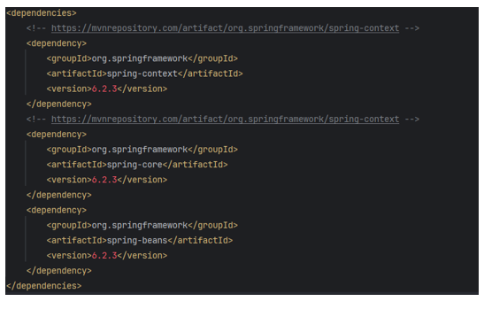
# a.1 : Création de la couche présentation basée sur Spring XML
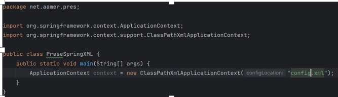
# a.2 : Création d’un objet ApplicationContext
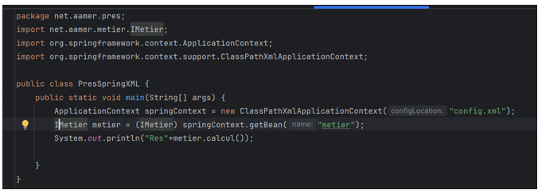
# a.3 : Récupération du bean via son ID
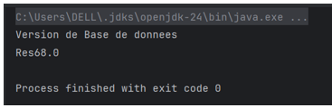
# a.4 : Instanciation via Setter Injection
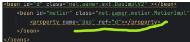
# a.5 : Instanciation via Constructor Injection
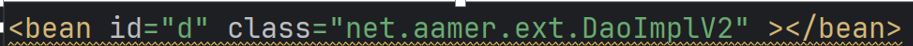

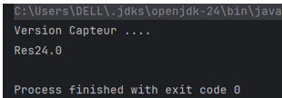
## b.	Spring avec Annotations

# b.1 : Activer la configuration par annotations

# b.2 : Déclarer les composants avec @Component
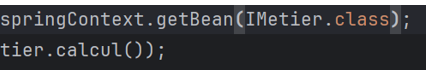
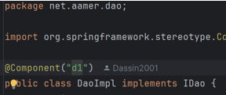
# b.3 : Injecter les dépendances avec @Autowired
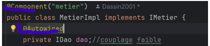
# b.4 : Gérer les conflits avec @Qualifier
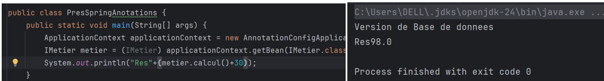
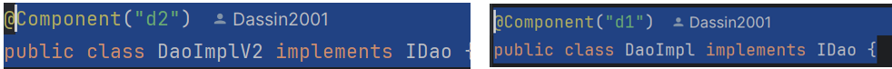
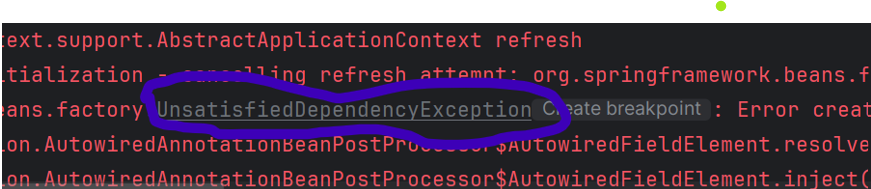
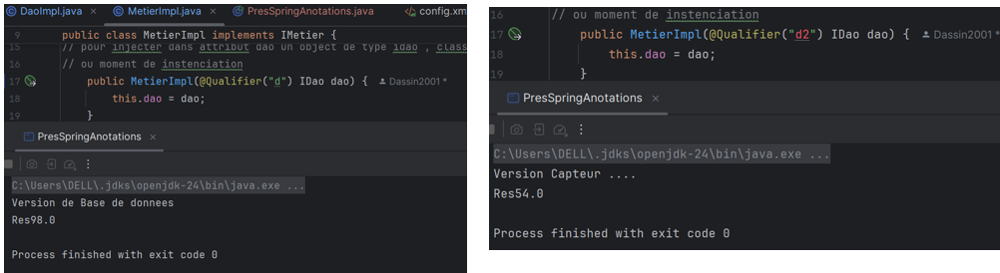

