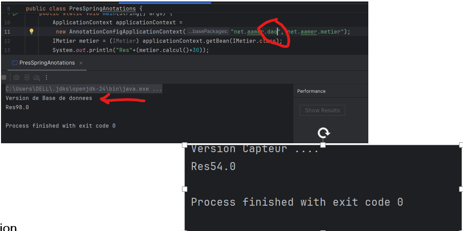

# TP1 - Systèmes Distribués  
## Injection des dépendances avec Java & Spring

Ce projet a été réalisé dans le cadre du module **Systèmes Distribués** (MSDIA-2024-2025). Il porte sur la compréhension et la mise en œuvre de l’**injection des dépendances (IoC)** à travers différentes approches Java, dont l’utilisation du **framework Spring**, ainsi que le développement d’un **mini framework maison**.

> **Réalisé par : AAMER FADMA**

---

## Objectifs du projet

- Appliquer le principe d’**Inversion de Contrôle** (IoC)
- Réduire le couplage entre les composants
- Comprendre plusieurs types d’injection : statique, dynamique, Spring XML et annotations
- Développer un mini framework qui simule Spring IoC

---

## Technologies utilisées

- Java 8+
- Spring Framework (IOC Container)
- JAX-B (pour XML Binding)
- IDE : IntelliJ IDEA
- Git & GitHub

---

## Partie 1 – Étude et expérimentation

L'injection de dépendances (Dependency Injection - DI) est un principe fondamental de la programmation orientée objet, souvent utilisé dans l’**inversion de contrôle** (IoC). Elle consiste à déléguer la création des dépendances d’un objet à un composant externe, favorisant ainsi un **faible couplage** entre les composants et facilitant la maintenance, les tests et l’extensibilité du code.

### ▶️ 1. Injection des dépendances par **Instanciation Statique**

Cette approche est la forme la plus simple d’injection des dépendances. Les dépendances sont créées manuellement avec `new`, directement dans la classe cliente. Cela permet un développement rapide, sans configuration externe, mais entraîne un **couplage fort**, ce qui rend le code difficile à tester et à maintenir dans des projets évolutifs.

#### Fonctionnement :
private DaoImpl dao = new DaoImpl();
IMetier metier = new MetierImpl(dao);

##-------------------------------------------------------------------------------
 	

Le composant MetierImpl dépend ici directement de l’implémentation DaoImpl, ce qui signifie qu’un changement de DAO nécessiterait de modifier cette ligne de code.

•	Injection des dependances par Instanciation dynamique utilise les capacités de réflexion de Java pour créer les objets et injecter leurs dépendances à l’exécution, sans utiliser explicitement l’opérateur new. Elle repose sur la méthode Class.forName().newInstance() pour instancier les classes dynamiquement à partir de leur nom, généralement fourni dans un fichier de configuration. Cette technique permet de créer des applications faiblement couplées, où les composants peuvent être remplacés facilement sans modifier le code source principal. C’est une méthode intermédiaire entre l’injection statique et l’utilisation de frameworks comme Spring. Elle est aussi souvent utilisée dans le développement de mini frameworks personnalisés. En revanche, cette méthode peut introduire des erreurs à l’exécution si les noms de classe sont incorrects ou si les dépendances ne sont pas bien gérées.
 	# Fonctionnement :
  

On charge la classe par son nom, puis on instancie dynamiquement l’objet associé. Ensuite, on l’injecte via un setter ou un constructeur dans une autre classe métier. 

String metierClassName = scanner.nextLine();
Class cMetier = Class.forName(metierClassName);
IMetier metier =(IMetier) cMetier.getConstructor(IDao.class).newInstance(d);

####   Spring framework
Le framework Spring est une solution professionnelle complète permettant de gérer l’injection de dépendances à travers le principe d’Inversion de Contrôle (IoC). Il automatise la création et la gestion du cycle de vie des objets grâce à un conteneur IoC. Spring permet deux grandes approches d’injection : par fichier XML ou par annotations.
### 1.	Injection des dépendances avec Spring (XML et Annotations)

## a.	Spring avec configuration XML
Dans cette approche, les dépendances sont décrites dans un fichier de configuration XML. Le fichier contient des balises <bean> qui définissent les objets à créer, leur identifiant (id), leur classe, et les dépendances à injecter (via constructor-arg ou property). Spring lit ce fichier au démarrage, crée les objets correspondants et effectue les injections automatiquement. Cette méthode centralise la configuration, facilite la gestion des dépendances dans des projets complexes, mais peut devenir verbeuse et difficile à maintenir dans des projets de grande taille.

# a.1 : Création de la couche présentation basée sur Spring XML
Dans une application en couches, la couche présentation (souvent appelée "main" ou "controller" dans les architectures MVC) est responsable de la récupération du contexte Spring et de l'exécution des traitements métier.
Elle commence par la création d’un objet central : l’ApplicationContext

# a.2 : Création d’un objet ApplicationContext
ApplicationContext est l’interface principale utilisée pour charger les beans déclarés dans le fichier XML. C’est le conteneur Spring qui lit la configuration XML, crée les objets (beans) définis et gère leur cycle de vie

# a.3 : Récupération du bean via son ID
Une fois le contexte chargé, on peut récupérer n’importe quel objet (bean) à l’aide de son identifiant (id) défini dans le fichier XML.

# a.4 : Instanciation via Setter Injection
L’injection via setter consiste à fournir les dépendances à une classe à l’aide de ses méthodes set(). Dans le fichier XML, cela se fait avec la balise <property>.

•	Spring crée une instance de DaoImpl.
•	Ensuite, il crée une instance de MetierImpl.
•	Il appelle automatiquement la méthode setDao() sur MetierImpl et lui injecte l'objet dao.

# a.5 : Instanciation via Constructor Injection
Dans cette méthode, les dépendances sont injectées directement au moment de la création de l’objet via son constructeur. Cela permet de garantir que l’objet ne sera jamais instancié sans ses dépendances obligatoires.
<constructor-arg ref="d" ></constructor-arg>
•	Spring crée d’abord l’objet dao.
•	Ensuite, il instancie MetierImpl en appelant le constructeur avec dao comme argument.
•	 Cela garantit que dao est présent dès la création de l’objet métier.
Basculer vers la version web services

Get bean avec interface

## b.	Spring avec Annotations
Avec l’évolution de Spring, l’approche par annotations est devenue la méthode la plus populaire pour gérer l’injection des dépendances. Elle remplace progressivement la configuration XML en permettant de définir les composants et leurs relations directement dans le code source à l’aide d’annotations Java. Cela rend le développement plus rapide, plus lisible, et limite les erreurs de configuration.
# b.1 : Activer la configuration par annotations

Pour que Spring puisse détecter les annotations dans le code, il faut d’abord configurer le conteneur pour qu’il analyse un ou plusieurs packages. Cela se fait via AnnotationConfigApplicationContext, qui remplace ClassPathXmlApplicationContext utilisé avec XML.

ApplicationContext applicationContext = new AnnotationConfigApplicationContext("net.aamer");

# b.2 : Déclarer les composants avec @Component
L’annotation @Component est utilisée pour indiquer à Spring qu’une classe est un bean (objet géré 	par Spring). Cette annotation peut être utilisée directement ou remplacée par des spécialisations 	plus explicites :
•	@Repository pour les classes DAO.
•	@Service pour les classes métier
•	@Controller pour les contrôleurs Web.

On ajoute l’annotation @Component  dans les classes qui implémente les interfaces 
donc pour la class dao

# b.3 : Injecter les dépendances avec @Autowired
L’annotation @Autowired permet à Spring d’injecter automatiquement une dépendance dans un constructeur, un setter, ou directement dans un champ (field injection). Spring identifie le type de dépendance nécessaire et injecte automatiquement le bon bean.

 pour la class métier on ajoute @autowired pour fait aussi l’injection des dépendances 

Puis on crie la couche présentation version annotation :

"c'est dire creer les Object on se basant sur les annotations " 

ApplicationContext applicationContext = new AnnotationConfigApplicationContext ("net.aamer");

Il fait une recherche sur les classe qui utilisent les annotations component dans le package spécifier (net.aamer), puis les instancies

# b.4 : Gérer les conflits avec @Qualifier
Lorsqu’il existe plusieurs implémentations d’une même interface, Spring ne peut pas déterminer automatiquement laquelle injecter. Pour résoudre cette ambiguïté, on utilise l’annotation @Qualifier, qui permet de spécifier explicitement le nom du bean à injecter.
Par exemple, dans le cas où deux classes implémentant une même interface sont annotées avec @Component, Spring va créer deux beans distincts (par exemple d1 et d2). Si l’on tente d’injecter cette interface sans préciser de @Qualifier, une exception sera levée, car Spring ne saura pas quelle implémentation choisir (d1 ou d2).

Si l’on ne précise pas l’implémentation à injecter, une erreur de type UnsatisfiedDependencyException sera levée par Spring, en raison de l’ambiguïté entre les différents beans disponibles.
Pour résoudre ce problème, on utilise l’annotation @Qualifier dans le constructeur (ou le point d’injection) de la classe qui dépend de l’interface concernée (par exemple dans Metier pour injecter Dao). Cette annotation permet de spécifier explicitement le nom du bean à injecter, évitant ainsi toute confusion

 	Une autre solution consiste à spécifier explicitement les packages à scanner lors de la création du contexte Spring. Cela permet de mieux contrôler les classes détectées par Spring et d’éviter certains conflits de beans non désirés.
  ApplicationContext applicationContext = new AnnotationConfigApplicationContext("net.aamer.ext","net.aamer.metier");

L’approche par annotations rend le code plus propre, plus lisible et moins verbeux qu’avec les fichiers XML. Spring automatise la détection, la création et l’injection des objets. Grâce à @Component, @Autowired, et @Qualifier, on peut structurer une application de manière claire, modulaire et facilement testable.

